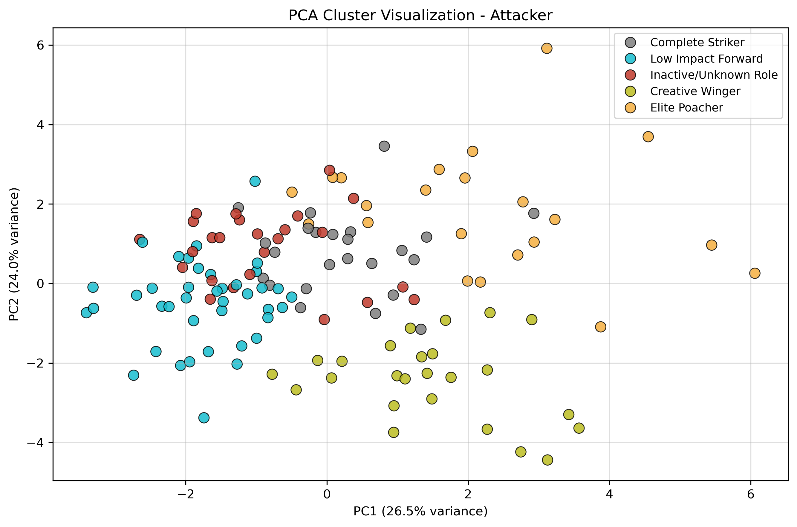
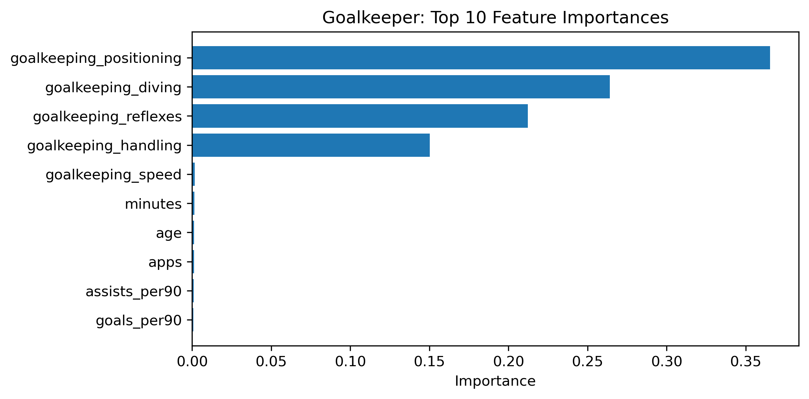

# Football Player Analytics ML

A football analytics portfolio project combining **unsupervised scouting models** and **supervised rating prediction**.

The repository contains two complementary machine learning workflows:

1. **Role-Based Scouting Clustering**  
   Uses KMeans clustering, PCA visualizations and role-profile analysis to identify football player archetypes.

2. **FIFA Overall Rating Prediction**  
   Uses position-specific XGBoost regressors to predict FIFA overall ratings, with a feature ablation that separates genuine performance signal from circular attribute features.

> **Key finding (rating prediction):** real-world performance explains **~48% of FIFA-rating variance** (R²), consistently across all positions. Adding FIFA's own technical attributes raises R² to **0.83–0.98**, but that gain is largely **circular** — the rating is derived from those attributes — and is largest for goalkeepers, whose rating is almost entirely attribute-defined.

---

## Project Highlights

- Position-specific modelling for goalkeepers, defenders, midfielders and attackers
- KMeans clustering for role discovery
- PCA 2D and 3D visualizations
- Normalized cluster heatmaps for role interpretation
- Role-based scouting scores
- Fuzzy name matching across football datasets
- XGBoost regression models for FIFA overall prediction
- **Performance-only vs full feature ablation** to quantify circularity
- Actual vs predicted plots
- Feature-importance analysis

---

## Repository Structure

```text
football-player-analytics-ml/
│
├── README.md
├── requirements.txt
├── .gitignore
│
├── run_all.py
├── run_scouting.py
├── run_rating_prediction.py
│
├── src/
│   ├── __init__.py
│   ├── scouting_clustering.py
│   └── rating_prediction.py
│
├── data/
│   ├── README.md
│   │
│   ├── scouting/
│   │   └── 2022-2023 Football Player Stats.csv
│   │
│   └── rating_prediction/
│       ├── players.csv
│       ├── appearances.csv
│       └── male_players.csv
│
└── outputs/
    ├── scouting/
    │   ├── plots/
    │   └── tables/
    │
    └── rating_prediction/
        ├── plots/
        └── tables/
```

Raw datasets are **not included** in this repository because they may have licensing restrictions. The generated `outputs/` (plots and summary tables) are committed so the results can be viewed without rerunning.

---

## 1. Role-Based Scouting Clustering

This module applies unsupervised learning to football player statistics from the 2022/23 season.

Players are first grouped by broad position (Goalkeeper, Defender, Midfielder, Attacker), then each group is clustered using position-specific features and mapped onto hand-defined role archetypes.

Example role archetypes:

- **Goalkeepers:** Modern Sweeper Keeper, Shot Stopper Specialist
- **Defenders:** Balanced Defender, Aggressive Ball Winner, Defensive Destroyer
- **Midfielders:** Creative Deep Playmaker, Defensive/Box-to-Box Mid
- **Attackers:** Complete Striker, Creative Winger, Elite Poacher, Low Impact Forward, Inactive/Unknown Role

The role assignments are interpretable and face-valid (e.g. Lewandowski → Complete Striker, Haaland → Elite Poacher, De Bruyne → Creative Deep Playmaker), though cluster separation is weak (silhouette 0.15–0.29), so results should be read as **archetype labelling**, not clean natural clusters.



---

## 2. FIFA Overall Rating Prediction

Position-specific XGBoost regressors predict FIFA overall, trained two ways on the **same train/test split**:

- **Performance only** — real-world stats: goals, assists, per-90 metrics, minutes, appearances, age.
- **Full** — performance stats **plus** FIFA technical attributes.

### Results (held-out test set)

| Position | Players | R² (performance only) | R² (full) | MAE (perf) | MAE (full) | ΔR² from attributes |
|----------|--------:|----------------------:|----------:|-----------:|-----------:|--------------------:|
| Attacker | 3,681 | 0.50 | 0.86 | 3.13 | 1.60 | +0.37 |
| Midfielder | 4,314 | 0.44 | 0.83 | 3.41 | 1.86 | +0.38 |
| Defender | 2,972 | 0.48 | 0.92 | 3.43 | 1.29 | +0.44 |
| Goalkeeper | 1,162 | 0.48 | 0.98 | 3.61 | 0.71 | +0.50 |

**Interpretation**

- **Performance alone explains ~48% of rating variance** across every position — likely driven as much by playing time and age (regular starters at strong clubs) as by raw output.
- The **ΔR² from attributes** measures the **circular** contribution: FIFA overall is derived by EA from those technical attributes, so the full model partly reconstructs a known formula rather than predicting from independent signal.
- That circular gain is **largest for goalkeepers** (+0.50, R² → 0.98), whose overall is almost entirely defined by their goalkeeping attributes — exactly as expected.

The full model's feature importances also reveal which attributes EA weights most per position:



---

## Dataset Setup

Create the following files locally (not included due to licensing).

### Scouting Clustering Dataset

```text
data/scouting/2022-2023 Football Player Stats.csv
```

Required columns include `Player`, `Pos`, plus the performance-stat columns used in `src/scouting_clustering.py`.

### Rating Prediction Datasets

```text
data/rating_prediction/players.csv          # player_id, name, position, date_of_birth
data/rating_prediction/appearances.csv      # player_id, date, goals, assists, minutes_played, game_id
data/rating_prediction/male_players.csv      # long_name, overall, player_positions, shooting, passing, pace, ...
```

---

## Installation

From the project root:

```bash
python -m pip install -r requirements.txt
```

If `python` is not recognized (e.g. Anaconda on Windows), use the full path to your Python executable, for example:

```powershell
C:\Users\<your-username>\anaconda3\python.exe -m pip install -r requirements.txt
```

---

## How to Run

```bash
python run_scouting.py            # scouting clustering only
python run_rating_prediction.py   # rating prediction only
python run_all.py                 # both
```

If `python` is not recognized (e.g. Anaconda on Windows), use the full path to your Python executable, for example:

```powershell
C:\Users\<your-username>\anaconda3\python.exe run_rating_prediction.py
```

---

## Outputs

Running the scripts regenerates everything under `outputs/`:

- **Scouting:** PCA 2D/3D plots, cluster heatmaps, top players by role, scouting summary.
- **Rating prediction:** actual-vs-predicted plots (performance-only and full), feature-importance charts, prediction tables, and a comparison summary.

---

## Methodology Notes

**Scouting module.** Exploratory. Role archetypes are defined by hand-crafted feature weights (`ROLE_PROFILES`); the number of clusters per position is set to match that taxonomy rather than the silhouette-optimal `k`. Results are best read as **archetype labelling**, validated only descriptively (silhouette).

**Rating-prediction module.** Because FIFA overall is derived by EA from its technical attributes, including those attributes makes the task partly **circular**. To handle this honestly, the pipeline trains a **performance-only** model alongside the **full** model on the same split; the performance-only result is the genuine, non-circular signal, and the gap to the full model quantifies the circular contribution (see Results).

---

## Tech Stack

- Python · Pandas · NumPy · Scikit-learn · XGBoost · RapidFuzz · Matplotlib · Seaborn

---

## Author

Markos Pantelis
